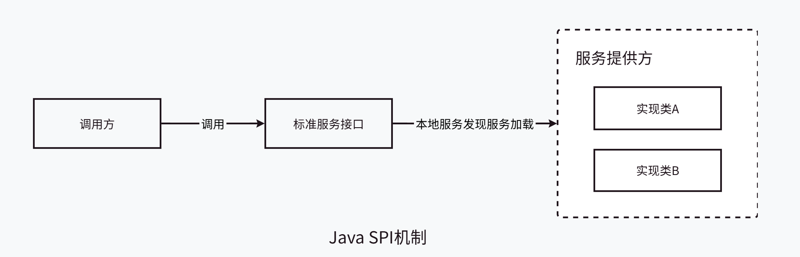

## 什么是SPI机制
**SPI**（Service Provider Interface），是JDK内置的一种 **服务提供发现机制**，可以用来启用框架扩展和替换组件，主要是被框架的开发人员使用。Java中SPI机制主要思想是将装配的控制权移到程序之外，在模块化设计中这个机制尤其重要，其核心思想就是 **解耦**。

SPI整体机制图如下：

在这里我们需要明确几个角色及各自的工作：
- **调用方**：使用标准服务功能的一方。
- **标准服务接口**：定义标准服务接口的一方。
- **服务提供方**：实现标准服务接口的一方。
  1. 提供实现标准服务接口的实现类
  2. 在classpath下的 **META-INF/services/** 目录里创建一个配置文件，文件名就是标准服务接口的全限定性类名
  3. 配置文件内容是需要加载的实现类的全限定性类名
  4. 接口实现按行配置，可以是多个。

当调用方调用标准服务接口的时候，JDK就可以通过接口的全限定性类名查找 **META-INF/services/** 中的配置文件，根据配置文件中的具体实现类名进行加载实例化，就可以使用服务提供方的具体服务实现了。JDK中查找服务的实现的工具类是：`java.util.ServiceLoader`。

## SPI的应用

###  JDBC DriverManager

#### **标准服务接口**：JDBC接口的定义
JDK定义了标准服务接口`java.sql.Driver`，具体的实现由不同厂商来提供的。

#### **服务提供方**：在mysql中的实现
在mysql的jar包中，找到 **META-INF/services** 目录，该目录下有一个名字为 **java.sql.Driver** 的文件，文件内容是`com.mysql.cj.jdbc.Driver`，这里面的内容就是针对JDK中定义的接口的实现。
